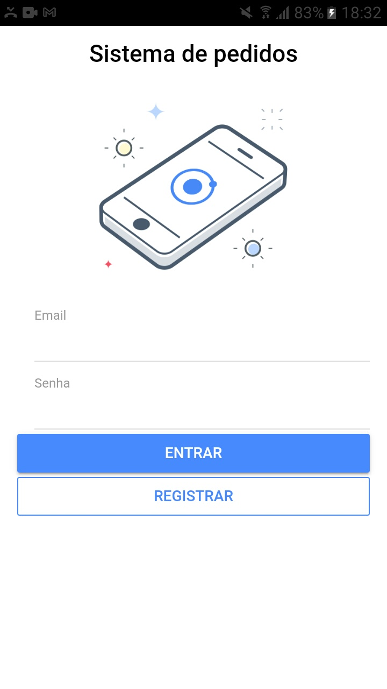
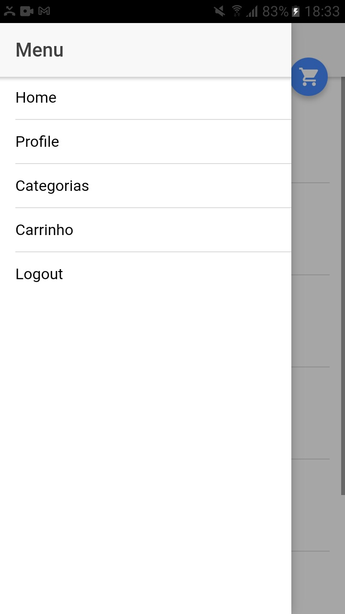
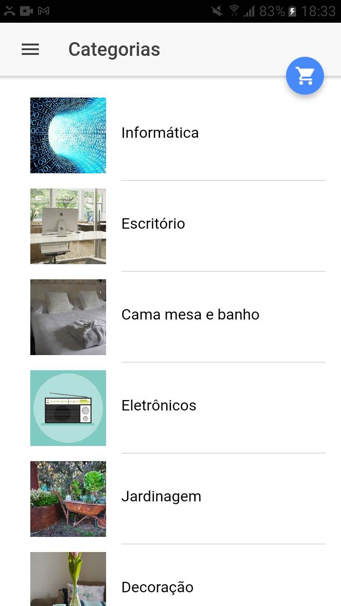

# Loja virtual

> Frontend de uma loja virtual. O backend referente a este projeto está localizado em: https://github.com/MalkonF/cursomc

<p float="left">
<kbd></kbd>
<kbd><kbd>
<kbd></kbd>
<kbd></kbd>
</p>

## Tecnologias usadas no Projeto

![node]
![npm]
![gradle]
![ionic]
![cordova]
![heroku]
![sdk]

## Antes de utilizar

### JDK

Tenha instalado o [JDK](https://www.oracle.com/br/java/technologies/javase/javase-jdk8-downloads.html) e as variáveis _JAVA_HOME_, _CLASSPATH_ e _PATH_ configuradas.

### NodeJS

Baixe o [nodejs](https://nodejs.org/pt-br/download/) e instale de acordo com seu sistema operacional.

### Ionic e Cordova

Instale o ionic e cordova pelo npm:

```
npm install -g ionic@3.19.0 cordova@7.1.0
```

Verifique as plataformas instaladas no seu projeto:

```
ionic cordova platform list
```

### Android SDK Tools

Baixe o [SDK Tools Package](https://developer.android.com/studio?hl=pt-br#downloads) de acordo com seu sistema operacional, extraia para a pasta c:\Android\sdk(se não existir, crie o diretório) e defina a variável de ambiente _ANDROID_HOME:_ para C:\Android\sdk ou então passe o sdk root como parâmetro, como:

```
sdkmanager.bat --sdk_root=C:\Android\sdk --list
```

Com este comando acima, foram listadas todos os pacotes relativos a cada versão do android. Escolha para qual versão o aplicativo vai ser construído e entre com(neste comando abaixo estou construindo a app para a versão 5.1 do Android):

```
sdkmanager.bat --sdk_root=c:\Android\sdk "platform-tools" "platforms;android-22" "build-tools;22.0.1" "extras;android;m2repository"
```

Agora defina as variáveis de ambiente no PATH:

- %ANDROID_HOME%\cmdline-tools
- %ANDROID_HOME%\cmdline-tools\bin
- %ANDROID_HOME%\platform-tools
- %ANDROID_HOME%\build-tools\22.0.1 (adapte para a versão que escolheu na instalação)

### Gradle

Crie uma pasta no C:\ chamada Gradle e extraia o conteúdo de https://gradle.org/next-steps/?version=6.6.1&format=bin lá.

Adicione o caminho(de acordo com a versão escolhida) C:\Gradle\gradle-6.6.1\bin na variável PATH.

### Execução

Adicione a plataforma android:

```
 ionic cordova platform add android --save

```

Conecte seu celular no computador, permita a depuração no seu dispositivo android e entre com comando:

```
 ionic cordova run android --device
```

Pronto, a app já está rodando no seu smartphone.

## Baixar app no Google Play

## Onde me encontrar?

- Twitter – [@RapazComum6](https://twitter.com/RapazComum6)
- E-mail - malkon.inf@gmail.com
- Linkedin - [Malkon Faria](https://www.linkedin.com/in/malkon-faria-1843b81a7/)

[node]: https://img.shields.io/badge/node.js-v12.19.0-%232E8B57
[npm]: https://img.shields.io/badge/npm-v6.14.8-%23B22222
[gradle]: https://img.shields.io/badge/gradle-v6.6.1-%2300FF00
[ionic]: https://img.shields.io/badge/ionic-v3.19.0-%23B0E0E6
[cordova]: https://img.shields.io/badge/cordova-v7.1.0-%238FBC8F
[heroku]: https://img.shields.io/badge/heroku-v7.47.0-%238A2BE2
[sdk]: https://img.shields.io/badge/Android-SDK-%239ACD32
